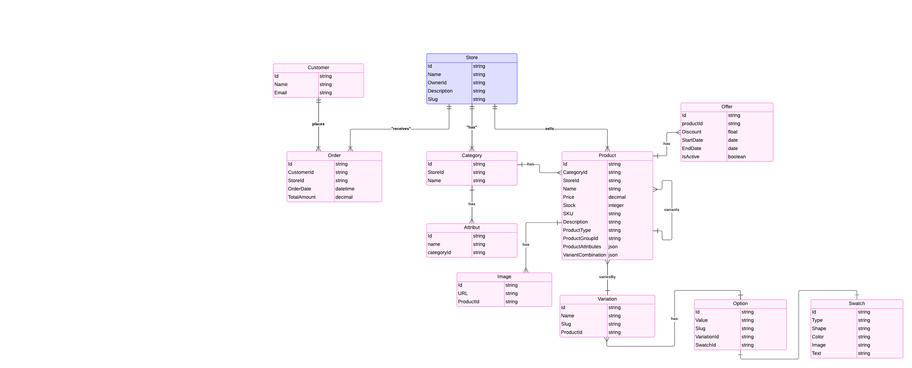

# NextCommerce

NextCommerce is a modern e-commerce platform built with Next.js and TypeScript. It allows users to register and manage stores, add categories and products, and view orders, clients, and analytics through a dashboard. The project includes an admin panel and a store display application.

## Features

- Store registration and management
- Category and product management
- Order and client tracking
- Admin dashboard with analytics
- Storefront display application

## Tech Stack

- **Frontend & Backend**: [Next.js](https://nextjs.org/)  
- **Language**: TypeScript  
- **Styling**: Tailwind CSS  
- **Database**: Supabase  
- **Authentication**: *****

## Database Schema

Below is the database schema used in the NextCommerce project:



## Getting Started

### Prerequisites

Ensure you have the following installed:  
- Node.js (v16 or higher)  
- npm or yarn  
- Supabase (or your preferred database setup)

### Installation

1. Clone the repository:  
   ```bash
   git clone https://github.com/yourusername/nextcommerce.git
   cd nextcommerce

